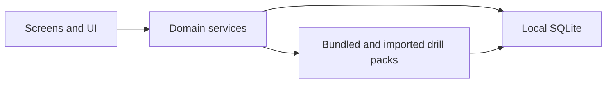
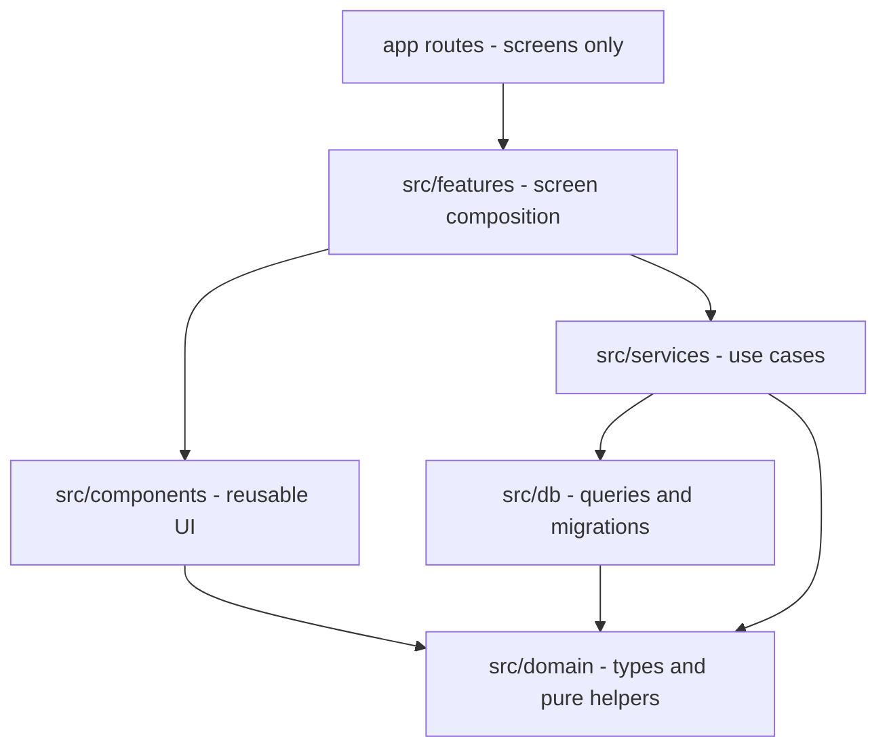

# The Range — Architecture

Technical architecture for The Range. Product/UX intent lives in [implementation.md](implementation.md). This document defines how the app is structured so main workflows stay offline, code stays reusable, and screens scale without becoming a dumping ground.

## Goals

- **Offline-first:** Browse drills, run sessions, save scores, and view history with no network.
- **Local ownership:** All user progress lives on-device. No auth backend in MVP.
- **Data-driven drills:** Screens are generic; drill content comes from loadable packs.
- **Clear ownership of code:** Screens stay thin; shared logic and UI live in known places.
- **Scalable screen layout:** Add screens and features without growing unmaintainable route files.

## Offline-first model



- Network is **not required** for Home, Drills, Drill Detail, Active Session, History, Session Detail, or local Settings.
- Bundled starter packs ship inside the app binary and seed the local database on first launch.
- Adding a pack from a file is a local filesystem / share-sheet operation, not a cloud fetch.
- Any future export/import of a profile is file-based (share out / pick file in), still offline-capable.
- Do not introduce API clients, auth SDKs, or sync queues in MVP. If a feature needs the network, it is out of scope until explicitly planned.

## Stack (MVP)

| Concern | Choice |
| --- | --- |
| App framework | Expo (managed) + TypeScript |
| Routing | Expo Router (file-based) |
| Local database | SQLite via `expo-sqlite` |
| Drill pack validation | Schema validation at load time (e.g. Zod) |
| UI | React Native + shared components under `src/components` |
| Persistence boundary | All reads/writes go through `src/db` + `src/services` — screens never open SQL directly |

## Layering

Strict dependency direction (outer → inner):



**Rules:**

1. **`app/`** — route wiring and screen entrypoints only. No business logic, no SQL, minimal JSX beyond composing feature views.
2. **`src/features/`** — one folder per major flow (home, drills, session, history, more). Feature screens and feature-only components live here.
3. **`src/components/`** — reusable UI used by two or more features (buttons, list rows, empty states, layout primitives).
4. **`src/services/`** — use-case functions: start session, log attempt, complete session, list drills, install pack. This is the primary home for non-UI “helper” workflow code.
5. **`src/db/`** — schema, migrations, and query functions. No React imports.
6. **`src/domain/`** — shared types, constants, and **pure** helpers (scoring math, formatting, pack ID rules). No I/O.
7. **`src/theme/`** — colors, typography, spacing tokens.

Screens call services. Services call db and domain. Never the reverse.

## Project layout

```
app/                          # Expo Router — thin route files only
  _layout.tsx                 # Root layout, DB bootstrap
  (tabs)/
    _layout.tsx               # Tab navigator
    index.tsx                 # Home route → features/home
    drills.tsx
    history.tsx
    more.tsx
  drill/
    [id].tsx                  # Drill Detail
  session/
    active.tsx                # Active Session
    [id].tsx                  # Session Detail (completed)

src/
  features/
    home/
      HomeScreen.tsx
      components/             # home-only UI
    drills/
      DrillsScreen.tsx
      DrillDetailScreen.tsx
      components/
    session/
      ActiveSessionScreen.tsx
      components/             # scoring controls, progress
    history/
      HistoryScreen.tsx
      SessionDetailScreen.tsx
      components/
    more/
      MoreScreen.tsx
      components/

  components/                 # shared across features
    ui/                       # Button, Text, Screen, EmptyState, ...
    drills/                   # DrillListItem, CategoryFilter, ...
    session/                  # shared session summary bits if needed

  services/
    drills.ts                 # list, get, search, filter
    packs.ts                  # install bundled/imported packs
    sessions.ts               # start, resume, log, complete, list
    settings.ts               # local prefs
    bootstrap.ts              # first-launch seed

  db/
    client.ts                 # open DB, run migrations
    schema.ts
    migrations/
    queries/
      drills.ts
      packs.ts
      sessions.ts
      settings.ts

  domain/
    types.ts                  # Drill, Pack, Session, Attempt, ...
    scoring.ts                # pure scoring helpers
    format.ts                 # dates, durations, score labels
    categories.ts

  theme/
    index.ts

assets/
  drills/                     # bundled starter pack JSON
```

### Scalable screen split

| Put it here | When |
| --- | --- |
| `app/...` route file | It only imports a feature screen and passes route params |
| `src/features/<name>/` | UI + state for one product area |
| `src/features/<name>/components/` | UI used only inside that feature |
| `src/components/` | UI reused by 2+ features |
| New feature folder | A new product area (e.g. trends) — do not bolt large new UI onto an unrelated feature |

Avoid “god screens.” If a screen file grows past a single clear job (layout + wiring), extract section components into that feature’s `components/` folder.

## Where helpers go (avoid duplicate bulky code)

Use this decision order before adding a new helper:

1. **Pure + reused across features** → `src/domain/`  
   Examples: compute session summary score, format duration, map category labels.
2. **Touches DB or filesystem** → `src/services/` (orchestrate) and/or `src/db/queries/` (SQL)  
   Examples: `startSession(drillId)`, `installPackFromUri(uri)`, `getPersonalBest(drillId)`.
3. **React component reused in 2+ features** → `src/components/`  
   Examples: primary button, drill list row, empty state.
4. **React component used in one feature only** → `src/features/<feature>/components/`  
   Examples: active-session make/miss pad, home resume banner.
5. **Never** dump shared logic into random `utils.ts` at the repo root, and **never** copy scoring or session logic between screens.

### Naming conventions

- Services: verb-led functions — `startSession`, `completeSession`, `listDrillsByCategory`.
- DB queries: noun/SQL-oriented — `insertAttempt`, `findSessionsByDrill`.
- Domain: pure names — `summarizeAttempts`, `formatScore`.
- One module per concern; prefer adding a function to an existing service over creating a new catch-all `helpers.ts`.

## Data model (logical)

Core entities stored locally:

- **Pack** — installed drill pack metadata (id, name, schema version, source).
- **Drill** — definition from a pack (id, pack id, name, category, instructions, scoring config, estimate).
- **Session** — a practice run (drill id, status: active/completed/abandoned, started/ended, notes).
- **Attempt** — logged steps within a session (index, payload matching scoring type, timestamp).
- **Settings** — key/value local prefs (display name, units, etc.).

Sessions and attempts are the source of truth for History and personal bests. Drill rows are replaced/updated when packs are installed or upgraded; historical sessions keep enough denormalized drill name/score summary to remain readable if a pack is removed later.

## Drill packs

- Versioned JSON documents under a documented schema (`schemaVersion`).
- Validated on install; invalid packs are rejected with a clear error — never partially written.
- Bundled packs in `assets/drills/` seed via `bootstrap` on first launch.
- User-installed packs go through `services/packs` → validated → written in a single DB transaction.
- Screens never parse pack files directly; they only read drills already in the database.

MVP scoring shapes the Active Session UI must support (extensible later):

- `makes_out_of` — N attempts, make/miss (or count makes)
- `reps` — count repetitions
- `score_total` — accumulate a numeric score

Scoring interpretation and summary math live in `domain/scoring.ts`. Input controls that bind to those shapes live in `features/session/components/`.

## Main offline workflows

| Workflow | Path |
| --- | --- |
| First launch | `bootstrap` opens DB, migrates, installs bundled packs |
| Browse drills | `services/drills` reads SQLite |
| Start practice | `services/sessions.startSession` → Active Session |
| Log attempts | writes to SQLite immediately (survive app kill) |
| Finish practice | `completeSession` + optional notes |
| Resume | Home reads active session; continue same row |
| History | query completed sessions; Session Detail loads attempts |
| Add pack | pick local file → validate → install transaction |
| Settings / clear data | local prefs; destructive clear wipes user tables (re-seed packs as designed) |

No workflow above waits on a server.

## Navigation (technical)

- Tabs under `app/(tabs)/` match [implementation.md](implementation.md): Home, Drills, History, More.
- Stack routes outside tabs: `drill/[id]`, `session/active`, `session/[id]`.
- Route files pass ids/params into feature screens; feature screens call services.
- Deep links are optional later; structure should not block them.

## Bootstrap and app startup

On root layout mount:

1. Open SQLite and run migrations.
2. If first launch (or empty packs), install bundled packs.
3. Only then render tabs (or show a minimal local loading state).

Failure to open the DB is a hard local error screen — not a login or network retry wall.

## Testing and quality boundaries (lightweight)

- Domain pure functions: unit-testable without React or DB.
- Services: testable against an in-memory or test SQLite when we add tests.
- Screens: keep logic out so UI stays shallow.

## Explicitly out of architecture (MVP)

- Auth, accounts, tokens
- Remote APIs / sync engines
- Paywalls / IAP
- Cloud-hosted drill catalogs as a hard dependency (local packs only)

## Related docs

- Product and screen design: [implementation.md](implementation.md)
- Visual design: [design.md](design.md)
- This file is the technical reference for the build phase
